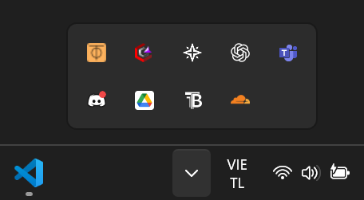

# 📘 Hướng dẫn kết nối MySQL Server qua ZeroTier + MySQL Workbench

## 👨‍💻 Chuẩn bị

* Máy tính cài **Windows/Mac/Linux**.
* Có Internet.
* Đã cài **MySQL Workbench** (nếu chưa: tải tại [https://dev.mysql.com/downloads/workbench/](https://dev.mysql.com/downloads/workbench/)).
* Có **Network ID** của team:

  ```
  xxxxx - Do Admin cấp
  ```
* Thông tin MySQL do admin cung cấp (Dưới đây là ví dụ):

  * **Server IP (ZeroTier)**: `xxxxx`
  * **Port**: `3306`
  * **Database**: `test_connect`
  * **Username**: `team_viewer`
  * **Password**: `password123`

---

## 🔹 1. Tải và cài ZeroTier

1. Vào [https://www.zerotier.com/download/](https://www.zerotier.com/download/).
2. Tải bản cho Windows/Mac/Linux.
3. Cài đặt như phần mềm bình thường.

---

## 🔹 2. Join vào mạng ZeroTier

1. Sau khi cài, mở ZeroTier app (icon dưới taskbar – Windows, menu bar – Mac).
2. Chọn **Join Network**.
3. Nhập Network ID:

   ```
   xxxx
   ```
4. Nhấn **Join**.
5. Báo cho admin → để **approve** trong [my.zerotier.com](https://my.zerotier.com).


---

## 🔹 3. Kiểm tra IP ZeroTier của bạn

* Sau khi được approve, ZeroTier sẽ cấp một IP dạng:

  ```
  172.30.x.x
  ```
* Kiểm tra IP:

  * Windows: mở CMD → gõ `ipconfig` → tìm dòng **ZeroTier One Adapter**.
  * Mac/Linux: gõ `ifconfig` hoặc `ip addr`.

👉 IP này chỉ để team bạn thấy nhau trong mạng riêng.

---

## 🔹 4. Tạo kết nối trong MySQL Workbench

1. Mở **MySQL Workbench**.
2. Nhấn **+** ở cạnh **MySQL Connections** để tạo kết nối mới.
3. Điền thông tin:

   * **Connection Name**: `Test-Connect` (hoặc tùy bạn đặt).
   * **Hostname**: `xxxxx` (IP ZeroTier của admin).
   * **Port**: `3306`.
   * **Username**: `team_viewer`. (Admin cung cấp)
   * Tick **Store in Vault** → nhập mật khẩu: `xxxx`. (Admin cung cấp)
4. Nhấn **Test Connection** → nếu thành công → **OK** → Save.

---

## 🔹 5. Truy vấn dữ liệu

* Click đúp vào connection vừa tạo để đăng nhập.
* Mở tab **Query** → chạy thử:

  ```sql
  SELECT * FROM customers LIMIT 10;
  ```
* Bạn chỉ có quyền **SELECT** để xem dữ liệu, không thể thay đổi dữ liệu.

---

## 🔒 Lưu ý

* Luôn đăng nhập bằng user `team_viewer`, **không dùng root**.
* Không chia sẻ mật khẩu ngoài team.
* Khi không dùng nữa, có thể **Exit ZeroTier app** để ngắt kết nối.

